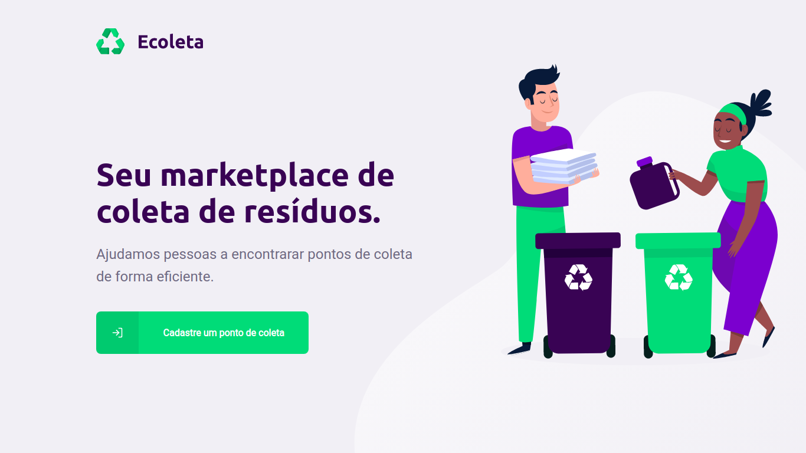

<h1 align="center">
    
</h1>
<p align="center">
  

  
	
  <a href="https://www.linkedin.com/in/lucas-diniz-santos-henrique-3aa825157/">
    
  </a>

  <a>
    
  </a>

  <a>
    
  </a>
  
</p>

Ecoleta is an application made during the Next Level Week 01. The main goal of this project is to connect people with companies and other kinds of business that collect specific waste such as batteries, paper, cooking oil, etc.  
<h1 align="center">

</h1>

## Technologies
This project was developed with the following technologies:
* Node.js;
* TypeScript;
* React;
* React Native;
* Expo.

## How To Use
Before the following instructions, make sure you have Git, Node.js + Yarn installed on your computer.

From your command line:

### Clone this repository
```$ git clone https://github.com/lcsdiniz/NextLevelWeek01_Ecoleta.git```

### Go into the directory
```$ cd NextLevelWeek01_Ecoleta/server```

### Install the dependencies
```$ npm install```

### Change the IP address statement in [ItemsControllers](server/src/controllers/ItemsController.ts) 
```$ cd src/controllers/```  
In [ItemsControllers.ts](server/src/controllers/ItemsController.ts) value, change the IP address to your local IP address.

### Repeat the installation of dependecies in the "web" and "mobile" directories
```$ cd NextLevelWeek01_Ecoleta/web```  
```$ npm install```

```$ cd NextLevelWeek01_Ecoleta/mobile```  
```$ yarn install```

### Running the API

#### Web version 
Run ```npm run dev``` in server directory and ```npm start``` in web directory.
Access the application from **localhost:3333**.

#### Mobile version
If you do not have the expo-cli on your computer, install it with ```npm install -g expo-cli```.  
Run ```npm run dev``` in server directory and ```yarn start``` in the mobile directory. 
Access **localhost:19002**, read the QR Code with your smartphone and use the app Expo to run the mobile version.

## Screens

### Web

#### 1 - Home page



#### 2 - Company/Business registration
(To be added)

### Mobile

#### 1 - Home


#### 2 - Map


#### 3 - Details


## Version
1.0.0.0

## Authors
* **Lucas Diniz** - [GitHub](https://github.com/lcsdiniz), [LinkedIn](https://www.linkedin.com/in/lucas-diniz-santos-henrique-3aa825157/)

This project is under the MIT license. See the [LICENSE](https://github.com/lcsdiniz/NextLevelWeek01_Ecoleta/blob/master/LICENSE) for details.


Made by Lucas Diniz.
